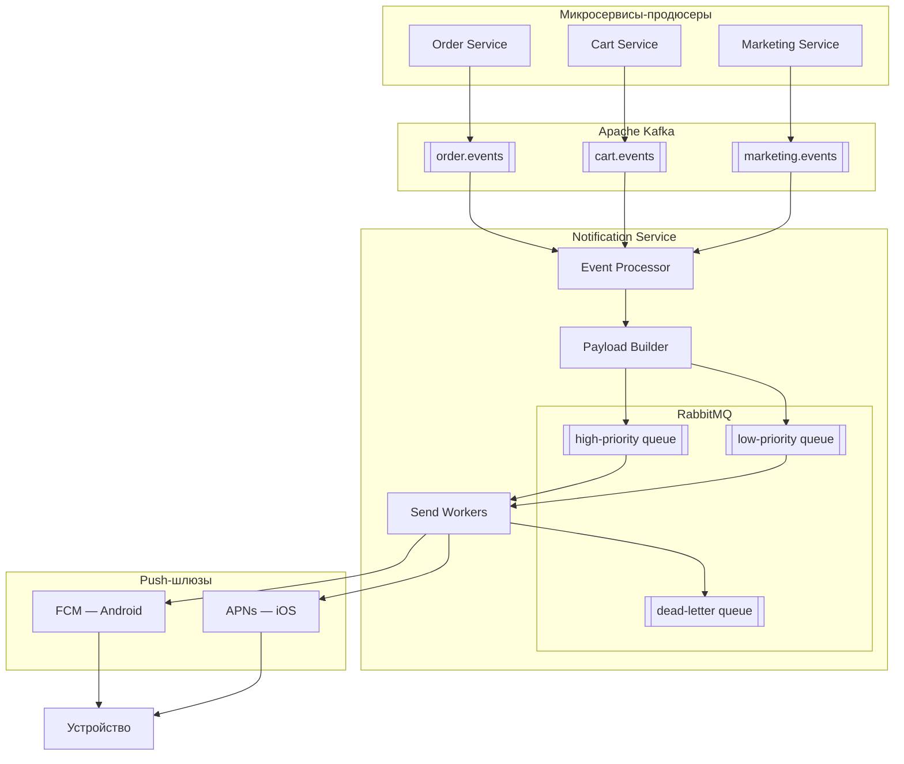
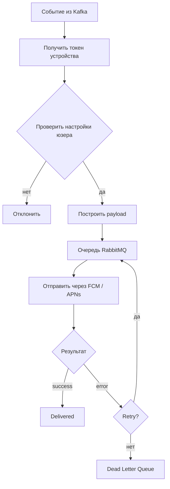

### **Архитектура PUSH-уведомлений**

Представим, что у нас есть три микросервиса, которым нужно отправлять пуши: сервис заказов, сервис корзины и маркетинговый сервис.
Эти микросервисы отправляют события в Kafka. Каждое событие публикуется в свой топик (например, для сервиса заказов — `order.events` и т.д.). При этом сами микросервисы ничего не знают про пуши — они просто сообщают, что произошло какое-то бизнес-событие.
Далее есть консюмер Kafka, назовём его **Сервис оповещений**. Он читает события и решает, нужно отправлять пуш или нет, в зависимости от настроек пользователя. Например, если у пользователя отключены рекламные уведомления, то `Event Processor` просто пропустит отправку такого события.
Если всё ок, то `Payload Builder` формирует JSON (title, body, deep link) по документации `FCM` или `APNs` и определяет приоритет сообщения.
Например:
- транзакционные события (оплата, отмена заказа) идут в **high-priority queue**
- рекламные — в **low-priority queue**

Обе очереди находятся в RabbitMQ.
Дальше сообщения обрабатываются пулом воркеров, которые читают очереди из RabbitMQ. Сначала обрабатывается high-priority очередь, потом low-priority.
Воркер определяет платформу устройства и отправляет пуш через нужный сервис:
- **FCM** — для Android
- **APNs** — для iOS

Если при отправке произошла ошибка, сообщение возвращается в RabbitMQ с увеличивающейся задержкой (например: 1s → 5s → 30s).
После нескольких неудачных попыток сообщение попадает в **dead-letter queue** для ручного разбора.

### **Схема общей архитектуры**

### **Схема внутреннего флоу Notification Service**

### **Почему используем Kafka + RabbitMQ**

Kafka используется для связи между сервисами, так как сервисы просто отправляют события. Kafka сообщения не теряются и не дублируются, при необходимости их можно прочитать заново. 

RabbitMQ из коробки предоставляет удобный механизм для ретраев.

**Почему не только Kafka?**

В Kafka нет приоритетов, нельзя задать TTL для конкретного сообщения, и сложно делать ретраи с задержкой

**Почему не только RabbitMQ?**

Если сообщение потерялось, то его уже не вернуть, и он хуже подходит для обмена событиями между сервисами
